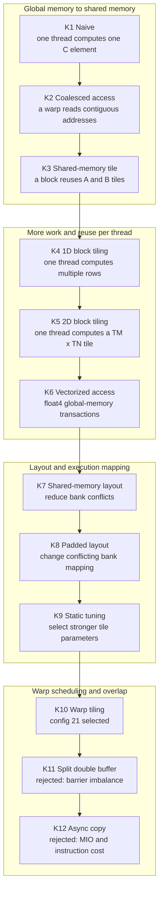

# CUDA FP32 GEMM Kernel实现与性能优化

A CUDA FP32 GEMM performance-engineering project covering kernel
implementation, compile-time parameter search, shape-aware dispatch,
correctness validation, and Nsight Compute bottleneck analysis.

## Highlights

- Implemented the optimization path from naive SGEMM to shared-memory tiling,
  vectorized access and warp tiling.
- Added arbitrary `M/N/K` support and deterministic correctness tests against
  cuBLAS.
- Searched 48 legal Kernel 10 configurations and generated specialized kernels
  for six measured matrix sizes.
- Added runtime dispatch for measured shapes and a bounds-checked fallback for
  unmeasured shapes.
- Used Nsight Compute and controlled experiments to explain why later
  double-buffering attempts were slower.

## Kernel optimization path



## Result

Tested on an NVIDIA GeForce RTX 5060 Ti with FP32 `4096 x 4096 x 4096` SGEMM.
Times below are ordinary CUDA-event measurements outside Nsight Compute.

| Kernel or experiment | Time | Throughput | Decision |
|---|---:|---:|---|
| K10 warp tiling, config 21 | **9.064 ms** | **15.163 TFLOP/s** | selected |
| K11 2:2 split double buffer | 10.702 ms | 12.842 TFLOP/s | rejected |
| K11 3:1 compute/load split | 14.969 ms | 9.182 TFLOP/s | rejected |
| K10 register double buffer | 10.577 ms | 12.994 TFLOP/s | rejected |
| K12 asynchronous copy | 79.733 ms | 1.724 TFLOP/s | rejected |

Parameter search had already found config 21 before profiling. Nsight Compute
did not produce a faster result; it explained why subsequent ideas failed:

- K11 lost issue opportunities at block-wide barriers because the compute and
  loading groups arrived at different times.
- K12 reduced some MIO and scoreboard stalls after request pacing, but added
  16.1% more instructions and did not improve runtime.
- K10 register double buffering increased registers from 168 to 182, reducing
  resident blocks per SM from three to two.

The detailed evidence is in
[the Phase 5 Nsight Compute case study](docs/phase5_nsight_compute_case_study.md).
Extracted metrics and the raw-report manifest are under
[reports/phase5/](reports/phase5/).

## Autotuning and dispatch

Kernel 10 searches block, warp and thread tile parameters:

```text
NUM_THREADS, BM, BN, BK, WM, WN, WNITER, TM, TN
```

The measured dispatch table selects configs 29, 11, 29, 38, 5 and 21 for
square sizes 128, 256, 512, 1024, 2048 and 4096 respectively. Other shapes use
a correctness-safe general fallback.

Relevant files:

```text
scripts/generate_k10_configs.py   legal configuration generation
scripts/autotune_k10.py           compile and benchmark automation
src/dispatch.cu                   runtime selection policy
```

## Build and run

Tested with CUDA Toolkit 12.8, Visual Studio 2022 Build Tools, CMake and Ninja.
Set `CUDA_COMPUTE_CAPABILITY` in `CMakeLists.txt` for the target GPU; the
checked-in value is `120`.

From an x64 Visual Studio Developer PowerShell:

```powershell
conda env create -f environment.yml
conda activate SGEMM_CUDA

cmake -S . -B build -G Ninja -DCMAKE_BUILD_TYPE=Release
cmake --build build --target sgemm
```

Run Kernel 10 on one shape:

```powershell
.\build\sgemm.exe 10 4096 4096 4096
```

Run deterministic random-shape correctness tests:

```powershell
.\build\sgemm.exe 10 --random-tests 100
```

Command format:

```text
sgemm <kernel 0-13>
sgemm <kernel 0-13> <M> <N> <K>
sgemm <kernel 1-13> --random-tests <count>
```

## Repository layout

```text
src/kernels/       CUDA kernels and controlled experiments
src/dispatch.*     shape-aware dispatch
scripts/           configuration search automation
docs/              Nsight Compute case study
reports/phase5/    extracted profiler evidence
```

## Acknowledgements

The initial educational kernels and benchmark structure were derived from
[siboehm/SGEMM_CUDA](https://github.com/siboehm/SGEMM_CUDA) and
[wangzyon/NVIDIA_SGEMM_PRACTICE](https://github.com/wangzyon/NVIDIA_SGEMM_PRACTICE).
This project adds arbitrary-shape correctness, parameter search, runtime
dispatch and the Nsight Compute analysis described above.

See [LICENSE](LICENSE).
